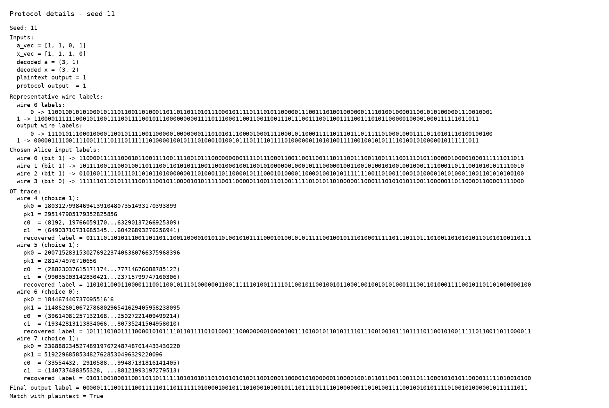
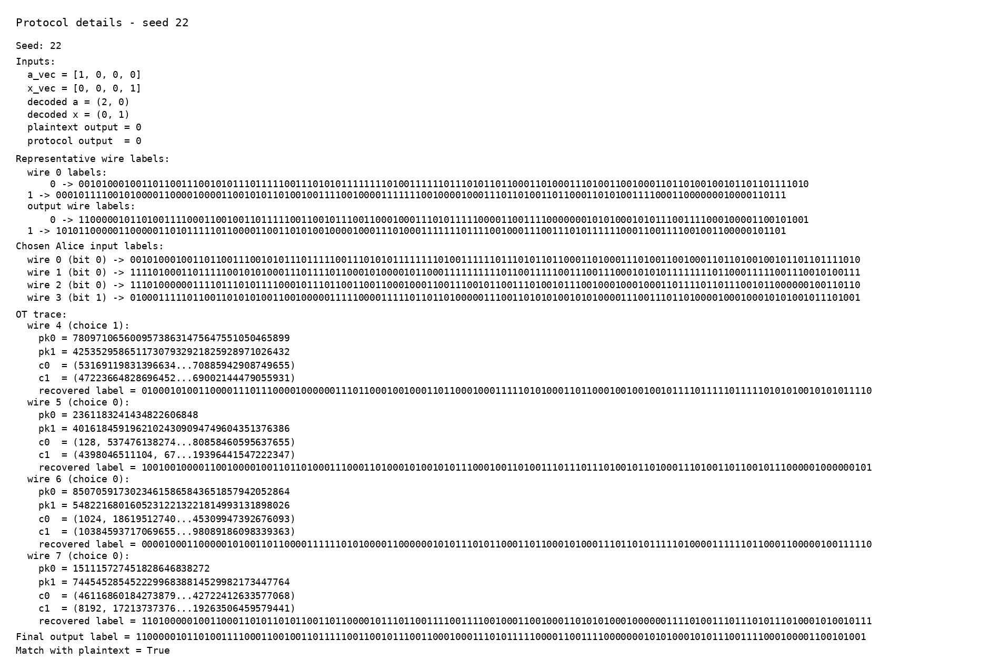
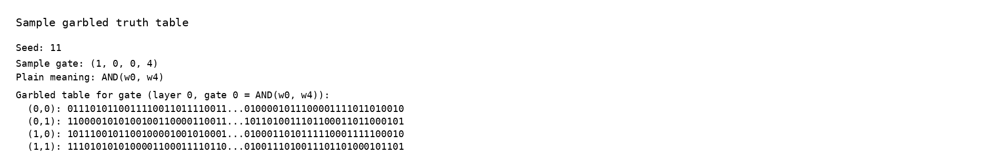
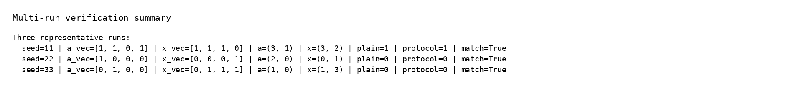

# 实验4 混淆电路实验报告

## 1. 实验目的
- 了解混淆电路算法的工作流程。
- 掌握混淆电路算法的基本原理。

## 2. 实验环境
- Python 3.10.19
- Jupyter nbconvert 7.17.0
- numpy / random / hashlib
- python-docx 1.2.0
- PIL + matplotlib.font_manager

## 3. 实验原理
本实验基于 Yao 混淆电路协议实现布尔电路计算。

目标函数：
```text
f_{a,4}(x) = 1  if  a1*x1 + a2*x2 >= 4
              0  otherwise
```

## 4. 核心代码
```python
Alice.GenerateLabels()
Alice.BuildGarbledCircuit()
garbled_circuit, labels, const_labels = Alice.SendCircuitAndGarbledInputs()
Bob.ReceiveCircuitAndGarbledInputs(garbled_circuit, labels, const_labels)

OT = OT(p, q, g)
for i in range(n):
    Bob.Receiver(OT, i)
    c0, c1 = Alice.Sender(OT, i)
    Bob.ReceiverOutput(OT, c0, c1, i)

Bob.ComputeOutput()
z = Alice.ReceiveOutput(Bob.SendOutput())
```

## 5. 结果汇总
| Seed | a_vec | x_vec | Decoded numbers | Plain / Protocol | Match |
| --- | --- | --- | --- | --- | --- |
| 11 | [1, 1, 0, 1] | [1, 1, 1, 0] | a=(3, 1), x=(3, 2) | 1 / 1 | Yes |
| 22 | [1, 0, 0, 0] | [0, 0, 0, 1] | a=(2, 0), x=(0, 1) | 0 / 0 | Yes |
| 33 | [0, 1, 0, 0] | [0, 1, 1, 1] | a=(1, 0), x=(1, 3) | 0 / 0 | Yes |

## 6. 实验截图





## 7. 结论
三组代表性输入下，协议输出与明文计算结果一致；另外 20 组随机自动校验也全部通过。

- [main.executed.ipynb](main.executed.ipynb)
- [experiment4_results.json](experiment4_assets/experiment4_results.json)