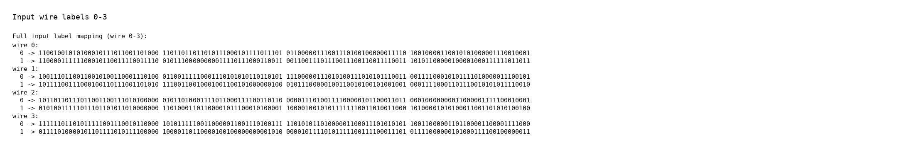
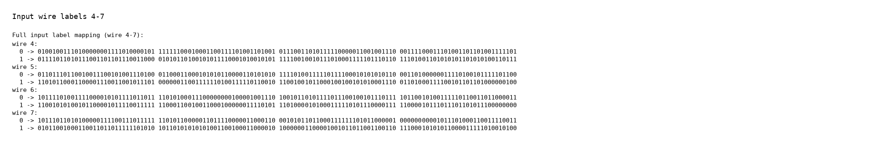
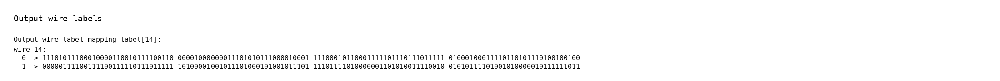
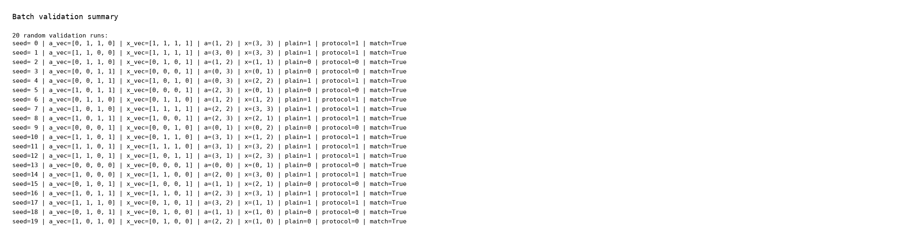

# 实验4 混淆电路实验报告

## 1. 实验目的
- 了解混淆电路算法的工作流程。
- 掌握混淆电路算法的基本原理。

## 2. 实验环境
- Python 3.10.19
- Jupyter nbconvert 7.17.0
- numpy / random / hashlib
- python-docx 1.2.0
- PIL + matplotlib.font_manager

## 3. 实验原理
本实验基于 Yao 混淆电路协议实现布尔电路计算。

目标函数：
```text
f_{a,4}(x) = 1  if  a1*x1 + a2*x2 >= 4
              0  otherwise
```

## 4. 运行说明
推荐在 Jupyter Lab 中打开 `main.ipynb` 并运行全部 cell，也可以在终端执行：
```bash
jupyter nbconvert --to notebook --execute main.ipynb --output main.executed.ipynb
```
代码结构上，`Alice` 负责生成导线标签和混淆电路，`Bob` 通过 OT 获取自己的输入标签并逐层解密，`Alice.ReceiveOutput` 最终把输出标签映射回明文结果。

## 5. 核心代码
```python
Alice.GenerateLabels()
Alice.BuildGarbledCircuit()
garbled_circuit, labels, const_labels = Alice.SendCircuitAndGarbledInputs()
Bob.ReceiveCircuitAndGarbledInputs(garbled_circuit, labels, const_labels)

OT = OT(p, q, g)
for i in range(n):
    Bob.Receiver(OT, i)
    c0, c1 = Alice.Sender(OT, i)
    Bob.ReceiverOutput(OT, c0, c1, i)

Bob.ComputeOutput()
z = Alice.ReceiveOutput(Bob.SendOutput())
```

## 6. 结果汇总
| Seed | a_vec | x_vec | Decoded numbers | Plain / Protocol | Match |
| --- | --- | --- | --- | --- | --- |
| 11 | [1, 1, 0, 1] | [1, 1, 1, 0] | a=(3, 1), x=(3, 2) | 1 / 1 | Yes |
| 22 | [1, 0, 0, 0] | [0, 0, 0, 1] | a=(2, 0), x=(0, 1) | 0 / 0 | Yes |
| 33 | [0, 1, 0, 0] | [0, 1, 1, 1] | a=(1, 0), x=(1, 3) | 0 / 0 | Yes |

## 7. 实验截图


## 8. 完整导线标签映射
下面给出一组代表性运行中 `label[0]` 的完整输入导线标签，以及输出导线 `label[14]` 的完整标签映射。




## 9. 20 组随机验证
为了进一步确认结果稳定性，这里给出 20 组随机输入的自动验证汇总。


| Seed | a_vec | x_vec | Decoded | Plain / Protocol | Match |
| --- | --- | --- | --- | --- | --- |
| 0 | [0, 1, 1, 0] | [1, 1, 1, 1] | a=(1, 2), x=(3, 3) | 1 / 1 | Yes |
| 1 | [1, 1, 0, 0] | [1, 1, 1, 1] | a=(3, 0), x=(3, 3) | 1 / 1 | Yes |
| 2 | [0, 1, 1, 0] | [0, 1, 0, 1] | a=(1, 2), x=(1, 1) | 0 / 0 | Yes |
| 3 | [0, 0, 1, 1] | [0, 0, 0, 1] | a=(0, 3), x=(0, 1) | 0 / 0 | Yes |
| 4 | [0, 0, 1, 1] | [1, 0, 1, 0] | a=(0, 3), x=(2, 2) | 1 / 1 | Yes |
| 5 | [1, 0, 1, 1] | [0, 0, 0, 1] | a=(2, 3), x=(0, 1) | 0 / 0 | Yes |
| 6 | [0, 1, 1, 0] | [0, 1, 1, 0] | a=(1, 2), x=(1, 2) | 1 / 1 | Yes |
| 7 | [1, 0, 1, 0] | [1, 1, 1, 1] | a=(2, 2), x=(3, 3) | 1 / 1 | Yes |
| 8 | [1, 0, 1, 1] | [1, 0, 0, 1] | a=(2, 3), x=(2, 1) | 1 / 1 | Yes |
| 9 | [0, 0, 0, 1] | [0, 0, 1, 0] | a=(0, 1), x=(0, 2) | 0 / 0 | Yes |
| 10 | [1, 1, 0, 1] | [0, 1, 1, 0] | a=(3, 1), x=(1, 2) | 1 / 1 | Yes |
| 11 | [1, 1, 0, 1] | [1, 1, 1, 0] | a=(3, 1), x=(3, 2) | 1 / 1 | Yes |
| 12 | [1, 1, 0, 1] | [1, 0, 1, 1] | a=(3, 1), x=(2, 3) | 1 / 1 | Yes |
| 13 | [0, 0, 0, 0] | [0, 0, 0, 1] | a=(0, 0), x=(0, 1) | 0 / 0 | Yes |
| 14 | [1, 0, 0, 0] | [1, 1, 0, 0] | a=(2, 0), x=(3, 0) | 1 / 1 | Yes |
| 15 | [0, 1, 0, 1] | [1, 0, 0, 1] | a=(1, 1), x=(2, 1) | 0 / 0 | Yes |
| 16 | [1, 0, 1, 1] | [1, 1, 0, 1] | a=(2, 3), x=(3, 1) | 1 / 1 | Yes |
| 17 | [1, 1, 1, 0] | [0, 1, 0, 1] | a=(3, 2), x=(1, 1) | 1 / 1 | Yes |
| 18 | [0, 1, 0, 1] | [0, 1, 0, 0] | a=(1, 1), x=(1, 0) | 0 / 0 | Yes |
| 19 | [1, 0, 1, 0] | [0, 1, 0, 0] | a=(2, 2), x=(1, 0) | 0 / 0 | Yes |

## 10. 结论
本实验完成了基于混淆电路的函数计算，并补充展示了完整的输入/输出标签映射、三组代表性运行和 20 组随机验证结果。20 组随机验证全部通过：是。

- [main.executed.ipynb](main.executed.ipynb)
- [experiment4_results.json](experiment4_assets/experiment4_results.json)